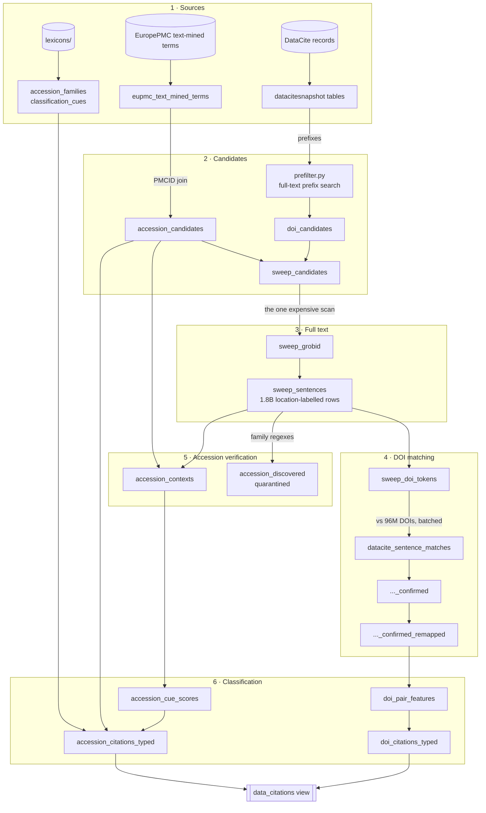

# Methods

## What this pipeline does, in one paragraph

Research articles use datasets. Some they *create*: a genomics paper deposits its sequences in GEO. Some they *reuse*: the same paper aligns reads against a reference genome someone else deposited years earlier. The scholarly record barely captures these links. They sit in article full text as dataset DOIs (`10.1594/pangaea.967352`) and accession IDs (`GSE37569`, `SAMN14299293`). This pipeline finds those mentions, checks each one against the article's own text, and classifies each link as **Primary** (data generated for that article) or **Secondary** (data reused). The product is one table, `data_citations`, with one row per (publication record, dataset identifier). Each row carries its classification, the rule that produced it and the evidence behind it. The public release is a narrow projection of that table — article DOI, dataset id and its kind, repository, citation type and release — while the rule, the evidence and the full per-citation trace are published in the reproducibility layer (§7). The method follows the winning solutions of the 2025 [Make Data Count Kaggle competition](https://www.kaggle.com/competitions/make-data-count-finding-data-references), adapted for production at corpus scale.

## How to read this document

Stages appear in dependency order. Each section says **what goes in, what comes out, and why the stage exists**. Table schemas are collapsed (click to expand); skip them on a first read. If you read only two things, read the diagram below and the worked example after it. A glossary sits at the end.

Row counts in the schema panels are labelled with the run they came from. Most are from the August 2026 reference run. They show order of magnitude, not current state; tables restated since carry their own date.

**Current release: 202610** (built 2 October 2026). **8,751,192 citations across 2,081,909 articles and 4,508,541 distinct datasets; 92.14% classified** as Primary or Secondary (687,407 Unclassified). 95.04% of citations are in open-access articles.

| Arm | Citations | Primary | Secondary | Unclassified | Classified |
|---|---|---|---|---|---|
| Dataset DOIs (DataCite) | 1,390,225 | 437,015 | 670,898 | 282,312 | 79.69% |
| Accessions (repository identifiers) | 7,360,967 | 1,382,858 | 5,573,014 | 405,095 | 94.50% |

Against the two community gold sets combined, the release agrees with 96.16% of the gold pairs it classifies and classifies 90.76% of them (§12 explains the benchmark and what it does not cover). Releases are rebuilt monthly, at 06:00 UTC on the 2nd of each month, with a full sweep of the corpus each time. The next release, 202611, is due on 2 November 2026.

## The shape of the pipeline

Two kinds of identifier flow through parallel paths that meet at the product view. We find dataset **DOIs** by searching full text ourselves. **Accession IDs** arrive already mined by EuropePMC; we verify and classify them. Both paths follow one rule: *an identifier counts only if its string is found in the article's text*. The one exception is an accession we cannot find in our copy of the text: it is kept on the strength of EuropePMC's own mining (provenance trust, §5).

## Where each idea came from

The pipeline is an adaptation, and credit matters. Each component's origin in the [competition write-ups](https://www.kaggle.com/competitions/make-data-count-finding-data-references) — or in this build — is explicit:

| Component | Origin |
|---|---|
| Two-stage shape (find mentions → classify type) | all five winners, independently converged |
| Corpus-join candidates (EuropePMC / DataCite as candidate sources, verified in text) | 1st place (core strategy), 5th place ("standing on the shoulders of Giants") |
| In-text verification as a hard filter | every winner; stated most explicitly by 1st and 2nd |
| Whitespace-stripped DOI matching (line-broken DOIs) | 2nd place (character-interleaved regex), 1st place (whitespace cleaning); our spaced-variant *prefilter* extends the idea to the search index |
| Version disambiguation (longest-DOI-wins) | 2nd and 3rd place (Dryad `.v2` stripping) |
| Metadata-similarity DOI classification (title/author/year vs dataset record) | 1st place (their strongest component — CatBoost; ours is rules then a boosted tree) |
| `IsSupplementTo` → Primary; earliest-citer-wins; popularity → Secondary | 2nd place (their rules-only system reached gold-medal level); popularity check also 3rd place |
| Forced family rules (SAMN/EMDB → Primary) | 2nd place — adopted, then **retired here** when adjudication showed reference-strain reuse breaks them; replaced by repository evidence |
| Reference-database families forced Secondary | 4th place (their assumed-secondary list) |
| Zero-shot LLM on mention context, constrained output | 1st place (Qwen + logit-constrained A/B; ours is 4-way with regex parse) |
| Cascaded inference (small model first, escalate uncertainty) | 4th place |
| Context engineering from structured XML (table rows, availability sections, refid remapping) | 5th place; our sentence table with location labels generalises it |
| Family-majority smoothing within an article | 1st place |
| Prompt enrichment with article/record metadata (incl. BioSample submitter) | 1st place — generalised here into the repository-evidence tier |
| False-positive family exclusions (GCA_, HGNC/GO/RRID, rs*, unfiltered ENA) | 1st, 2nd, 3rd place collectively |
| Derived labels as training data for a distilled model | 4th place (synthetic-label agent) — here trained on repository evidence instead |
| Community-corrected benchmark labels | rdmpage (competition participant, not a winner — the community precedent our gold-set programme builds on) |
| **New in this build** (no competition antecedent): repository-evidence decision rules at scale, GenBank attribution fetched for cited nucleotide and protein records, the precision floor with honest Unclassified, calibrated model claims, per-dataset Primary uniqueness, the recall-audit methodology | this pipeline |

## A worked example: one citation, end to end

Article `10.1111/gcb.17553` (*Global Change Biology*, 2024) says in its data-availability section that its datasets are archived at PANGAEA. It prints the DOI as `10. 1594/pangaea.967352`, with a line-break space after `10.`. Follow it through:

1. **Candidates.** The prefilter searches full text for every DataCite DOI prefix. The intact phrase `10.1594` does NOT match this article, because the full-text index split the broken string into separate tokens. So the prefilter also searches the spaced variant `"10. 1594"`, which matches, and the article enters `doi_candidates`. (A human spot-check found exactly this case. The variant recovers ~9% of otherwise-missed articles at high-recall repositories.)
2. **Full text.** The article's structured full text lands in `sweep_grobid`. The sentence explosion writes its availability-statement sentence to `sweep_sentences` with `location = 'availability_sentences'`.
3. **Token extraction.** The sentence is whitespace-stripped — `10. 1594/pangaea.967352` becomes `10.1594/pangaea.967352` — and split into prefix `10.1594` + tail candidates. One row lands in `sweep_doi_tokens` with `doibit_tail = 'pangaea.967352…'`.
4. **Matching.** The batched join finds the DataCite DOI `10.1594/pangaea.967352`: its prefix equals the token's, and its tail is a prefix of `doibit_tail`. That gives a row in `datacite_sentence_matches`. Longest-match dedup keeps it in `…_confirmed`. The DOI was found in the text, not only in the bibliography, so remapping passes it through unchanged.
5. **Classification.** `doi_pair_features` joins the pair with DataCite metadata (PANGAEA client, resource type Dataset, dataset creators) and article metadata. The dataset's creators overlap the article's authors and the years match, so the metadata-similarity rule assigns **Primary**. The per-dataset uniqueness pass confirms this is the earliest citing paper, so Primary stands, with `rule_applied = 'metadata_match'`.
6. **Product.** One row in `data_citations`: this publication record, this dataset DOI, `id_kind='doi'`, `type='Primary'`, `evidence_source='grobid_text_mined'`.

The accession path is shorter but similar. Take the sentence *"The ST RNA-seq data were obtained from GEO at GSM5420750…"*. The GSM accession arrives from EuropePMC's mining (`accession_candidates`). It is found verbatim in the sentence, which puts a row in `accession_contexts`; that row is what "verified" means. The cue lexicon scores `obtained from` + `from GEO` as reuse language, giving **Secondary** with `rule_applied = 'cue_secondary'`. A sentence reading *"Data are available via ProteomeXchange with identifier PXD031223"* in an availability section scores as deposition, giving **Primary** with `rule_applied = 'cue_primary'`.

**Design invariants**, which recur in every stage:

- an identifier counts only if its string is found in the article's text (accessions EuropePMC mined but we cannot find are kept under provenance trust, §5);
- every classification carries the rule that produced it;
- expensive scans are cost-estimated by dry run and capped;
- every automated conclusion is checked on a human-read sample before it is trusted.

## 1 · Source preparation

*Inputs: DataCite metadata records, EuropePMC's text-mined accession files, this repo's lexicons. Outputs: five reference tables everything downstream joins against. Why: the pipeline never trusts a mined identifier on its own — these tables are the authorities it verifies against (which DOIs exist, which accession shapes are valid, which words signal deposition vs reuse).*

**EuropePMC Text-Mined Terms** — EuropePMC runs its own text mining over publisher XML and publishes the results as per-database CSV files (refreshed ~weekly). We load 28 selected families, the ones the Kaggle winners found reliable. Families dominated by false positives (GCA_ genome assemblies, HGNC/GO/RRID ontology identifiers, clinical-trial numbers) are not downloaded at all: excluding them at the door is cheaper than filtering them later. (The upstream files were 0 bytes from before 4 September 2026 until 6 October 2026, when Europe PMC republished. The 202610 release still ran on the last good copy, loaded 21 September; the next monthly run, 202611 on 2 November, is the first to read fresh data. See §13.)

### `eupmc_text_mined_terms`

<i>7,539,971 rows at the August 2026 reference run; clustered by family, accession — click for schema</i>

| Column | Type | Description |
|---|---|---|
| `accession` | STRING | Accession identifier as text-mined (casing preserved as it appeared in the article). |
| `pmcid` | STRING | PubMed Central ID of the annotated article (primary join key to publication metadata). |
| `ext_id` | STRING | External article ID in the SOURCE namespace — the PMID when source='MED' (fallback join key). |
| `source` | STRING | Article ID namespace of ext_id (MED, PMC, PPR…). |
| `family` | STRING | Accession family / repository key (matches `accession_families.family`, derived from the EuropePMC per-database file names). |

**Lexicons** — two small curated tables loaded from `lexicons/`. `accession_families` holds each family's validation regex (machine-verified; several identifiers.org registry defects corrected), a false-positive risk class, and a Primary/Secondary prior. `classification_cues` holds the 26 deposition-vs-reuse phrases used to classify mention sentences.

### `accession_families`

<i>28 rows at the August 2026 reference run — click for schema</i>

| Column | Type | Description |
|---|---|---|
| `family` | STRING | Accession family / repository key (matches `accession_families.family`, derived from the EuropePMC per-database file names). |
| `patterns_key` | STRING | Key into accession_patterns.json (NULL for prior-only families without a validation pattern). |
| `pattern` | STRING | Anchored validation regex (RE2). See the patterns file for provenance and known registry defects corrected. |
| `fp_risk` | STRING | False-positive risk class (low/medium/high); only fp_risk='low' families enter regex discovery. |
| `default_type_prior` | STRING | Primary-leaning (deposition archives) / secondary-leaning (reference databases) / mixed. |

### `classification_cues`

<i>26 rows at the August 2026 reference run — click for schema</i>

| Column | Type | Description |
|---|---|---|
| `cue_id` | STRING | Short cue name (see lexicons/cue_lexicon.json for notes and rationale). |
| `direction` | STRING | primary (deposition language) or secondary (reuse language). |
| `pattern` | STRING | Case-insensitive RE2 regex applied to mention sentences. |
| `weight` | FLOAT | Score contribution; primary cues add, secondary cues subtract. |

**The DataCite DOI universe** (stage `10`) — every DataCite DOI, minus records aliased to IGSN samples or arXiv preprints (different identifier ecosystems, handled elsewhere). A DOI found in text only counts if it exists here — this is what makes matching *verification* rather than pattern-guessing. The row-numbered copy exists purely so the matching loop can process 96M DOIs in fixed 5M slices.

### `datacitesnapshot_no_igsnarxiv`

<i>96,057,345 rows at the August 2026 reference run — click for schema</i>

| Column | Type | Description |
|---|---|---|
| `doi` | STRING | DataCite DOI. Records carrying IGSN or arXiv alternate identifiers are excluded (handled elsewhere / out of scope). |

### `datacitesnapshot_no_igsnarxiv_r`

<i>96,057,345 rows at the August 2026 reference run — click for schema</i>

| Column | Type | Description |
|---|---|---|
| `doi` | STRING | As above. |
| `rownumber` | INTEGER | Stable row number ordered by DOI — enables the batched matching loop to process the 96M-DOI universe in fixed-size slices. |

## 2 · Candidate generation

*Inputs: the DOI prefix list; EuropePMC annotations; publication metadata. Outputs: the set of articles worth paying to read. Why: scanning every article's full text is the expensive operation — candidates shrink it to articles with evidence of a data citation.*

**DOI candidates** (`scripts/prefilter.py`) — instead of reading all full text, we ask the full-text search index which articles contain any DataCite DOI *prefix* (`10.1594`, `10.5061`, …). Prefixes are batched ~200 per query. Each prefix is searched intact AND as the phrase-quoted line-broken variant (`"10. 1594"`) — see the worked example for why. Batches that exceed the API's 50k-result window are split by year; every batch checkpoints to disk, and a failed batch aborts the run rather than silently dropping its articles (an earlier version lost results exactly that way).

### `doi_candidates`

<i>1,796,525 rows at the August 2026 reference run — click for schema</i>

| Column | Type | Description |
|---|---|---|
| `id` | STRING | Publication record ID returned by the full-text prefix search (intact + line-broken DOI-prefix variants). |

**Accession candidates** (stage `20`) — EuropePMC's annotations are keyed by PMCID, so a join to publication metadata (PMCID first, PMID fallback for MED-sourced rows) turns them into (accession, publication record) pairs; ~98–99% resolve. Two flags matter downstream: `has_fulltext` (can we verify this pair ourselves?) and `in_doi_candidate_set` (was this article already being read for DOI reasons?). Europe PMC sometimes annotates one article under two records — its MEDLINE record and its PMC full-text record, or two PMIDs sharing a PMCID — and both resolve to the same publication. The stage keeps one candidate per (publication, accession, family), preferring the PMC record. Before release 202610 this was not done, and about 2,100 citations (0.02%) appeared twice in the product.

### `accession_candidates`

<i>7,539,971 rows at the August 2026 reference run; clustered by family, accession — click for schema</i>

| Column | Type | Description |
|---|---|---|
| `accession` | STRING | Accession identifier as text-mined (casing preserved as it appeared in the article). |
| `family` | STRING | Accession family / repository key (matches `accession_families.family`, derived from the EuropePMC per-database file names). |
| `pmcid` | STRING |  |
| `ext_id` | STRING |  |
| `source` | STRING |  |
| `publication_id` | STRING | Citing publication record ID. Preprints and published versions are separate records — the dataset grain is one row per (publication record, dataset ID); collapse to works at query time via your publication metadata's preprint→published linkage. |
| `has_fulltext` | BOOLEAN | Whether the matched publication has structured full text available. |
| `in_doi_candidate_set` | BOOLEAN | Whether the article was already a DOI-prefilter candidate (pre-sweep context availability). |

**The widened sweep set** (stage `30`) — the union: articles the DOI prefilter flagged plus articles carrying accessions. This is the definitive "articles we will read" list.

### `sweep_candidates`

<i>2,904,164 rows at the August 2026 reference run — click for schema</i>

| Column | Type | Description |
|---|---|---|
| `id` | STRING | Publication record ID in the widened sweep set (DOI candidates ∪ accession-bearing articles with full text). |

## 3 · Full text and the sentence table

*Inputs: the sweep set; the structured-fulltext source table. Outputs: a per-article fulltext subset, then a flat table of every sentence with a section label. Why: one expensive scan, paid once, that every later stage re-reads cheaply.*

**The paid join** (stage `31`) — pulls structured full text for every sweep candidate. A warehouse quirk makes this the pipeline's entire cost story: the source table's fulltext column is scanned end-to-end no matter how few articles you ask for. So the pipeline pays that scan exactly once per release, materializes the subset, and never touches the source again. The runner dry-runs the cost and refuses to proceed over a configurable cap.

### `sweep_grobid`

<i>2,770,061 rows at the August 2026 reference run; clustered by id — click for schema</i>

| Column | Type | Description |
|---|---|---|
| `id` | STRING | Publication record ID. |
| `fulltext` | RECORD (structured full text: abstract/body/availability/... sections with sentences, tables with rows, graphics, bibliography references) | Structured full text (GROBID-style TEI-derived): abstract/body/availability/acknowledgement/annex/funding sections with per-sentence text and citation refids, tables with rows, graphics, bibliography references with parsed IDs. |

**Sentence explosion** (stage `32`) — structured full text is nested (sections → paragraphs → sentences; tables → rows; references → parsed fields). This stage flattens all of it into one row per sentence/title/table-row, labelled with **where in the article it came from**. That location label does real work later: a mention in a data-availability statement leans Primary; a mention only reachable through the bibliography leans Secondary; table rows carry accessions that never appear in prose. Reference *titles* and parsed reference *URIs* get their own rows because the source schema exposes no raw bibliography strings — these are the closest proxies for identifiers buried in reference entries.

### `sweep_sentences`

<i>1,799,397,759 rows at the August 2026 reference run; clustered by publication_id — click for schema</i>

| Column | Type | Description |
|---|---|---|
| `publication_id` | STRING | Citing publication record ID. Preprints and published versions are separate records — the dataset grain is one row per (publication record, dataset ID); collapse to works at query time via your publication metadata's preprint→published linkage. |
| `location` | STRING | Section location label from the sentence explosion (e.g. body_sentences, availability_sentences, tables_rows, references_titles). |
| `text` | STRING | Sentence / title / table-row text. |

## 4 · DOI matching

*Inputs: the sentence table; the DataCite DOI universe. Outputs: verified (article, dataset DOI) pairs with their mention sentences. Why: a DOI-shaped string in text is only a citation if it is a real DataCite DOI — matching is string-finding plus existence-checking in one step.*

**Token extraction** (stage `40`) — every sentence is whitespace-stripped (this single normalization is what makes line-broken DOIs matchable) and `DOI:` variants normalized, then split wherever a DataCite prefix appears, yielding candidate (prefix, tail) tokens.

### `sweep_doi_tokens`

<i>1,621,278 rows at the August 2026 reference run — click for schema</i>

| Column | Type | Description |
|---|---|---|
| `publication_id` | STRING | Citing publication record ID. Preprints and published versions are separate records — the dataset grain is one row per (publication record, dataset ID); collapse to works at query time via your publication metadata's preprint→published linkage. |
| `location` | STRING | Section location label from the sentence explosion (e.g. body_sentences, availability_sentences, tables_rows, references_titles). |
| `doi_prefixes` | STRING | DOI prefix token found in the sentence (whitespace-stripped, DOI:→doi: normalized, split on 'doi:' and '/'). |
| `text` | STRING |  |
| `doibits` | STRING | The colon-delimited fragment the prefix was found in (lowercased), for debugging. |
| `doibit_tail` | STRING | Reconstructed candidate DOI tail: '/'-joined tokens following the prefix. Matching tests STARTS_WITH(doibit_tail, dataset_doi_tail). |

**Batched matching** (stage `41` + runner loop `42`) — tokens join against the 96M-DOI universe in 5M slices: prefix must match exactly, and the real DOI's tail must be a prefix of the token's reconstructed tail (trailing punctuation and following text make exact tail equality too strict).

**IGSN sample identifiers** (stages `45`–`47`) — physical-sample identifiers (rock cores, sediment samples, museum specimens) were excluded from the main DOI universe above (stage `10`'s `HAVING` clause) until October 2026: at 9.4M records (6.9% of all DataCite, concentrated in ~19 registrant prefixes — SESAR and Geoscience Australia dominant), including them grew the batched matching loop enough to make it noticeably slower, for a citation volume nobody had measured. Since January 2023, IGSN e.V.'s partnership with DataCite means an IGSN **is** a DataCite DOI (e.g. `10.58052/IEAWL0054` under SESAR's prefix), typically written in text with an `IGSN:`/`igsn:` label in front — a label the main token-extraction stage (`40`) doesn't recognise, so even papers that do cite one would have been invisible to it regardless of the universe exclusion.

Rather than grow the 96M-DOI universe and its batch loop by 9.4M rows for an unmeasured population, IGSN gets its own small, separate path:
- **Stage `45`** builds a small IGSN-only universe (just the excluded 9.4M records).
- **Stage `46`** filters sentences down to the rare subset that actually contains `igsn` *before* doing any string splitting — on the corpus at the time of writing, 1.83B sentences filtered down to 12 candidates — then normalizes `IGSN:`/`igsn:` to `doi:` the same way stage `40` already normalizes `DOI:`, so the bare citation form (`IGSN:10.58052/...`, no URL) is found at all.
- **Stage `47`** joins that small candidate set against the small universe — cheap by construction, since the join is driven by the tiny side — and inserts verified matches straight into `datacite_sentence_matches` below, so everything downstream (dedup, reference remapping, typing, classification) treats an IGSN citation exactly like any other DOI citation with no further changes.

Measured on first deployment: 12 raw candidates, 5 verified (the rest were bibliography fragments and truncated table entries that correctly failed verification against the real registry — the same "a candidate only counts if it's actually found" discipline the DOI and accession arms already apply).

### `datacite_sentence_matches`

<i>2,497,304 rows at the August 2026 reference run — click for schema</i>

| Column | Type | Description |
|---|---|---|
| `publication_id` | STRING | Citing publication record ID. Preprints and published versions are separate records — the dataset grain is one row per (publication record, dataset ID); collapse to works at query time via your publication metadata's preprint→published linkage. |
| `location` | STRING | Section location label from the sentence explosion (e.g. body_sentences, availability_sentences, tables_rows, references_titles). |
| `doi_prefixes` | STRING |  |
| `text` | STRING |  |
| `doibit_tail` | STRING |  |
| `doi` | STRING | DataCite DOI whose prefix+tail matched this sentence token (pre-dedup: a token can match multiple version-variant DOIs). |

**Longest-match dedup** (stage `43`) — versioned repositories register `…/dryad.123` *and* `…/dryad.123.v2`; a token can match both. Per (article, sentence, tail) the longest matching DOI wins.

### `datacite_sentence_matches_confirmed`

<i>1,462,441 rows at the August 2026 reference run — click for schema</i>

| Column | Type | Description |
|---|---|---|
| `publication_id` | STRING | Citing publication record ID. Preprints and published versions are separate records — the dataset grain is one row per (publication record, dataset ID); collapse to works at query time via your publication metadata's preprint→published linkage. |
| `doi` | STRING | Matched DataCite DOI after longest-match dedup (per sentence+tail, the longest matching DOI wins — version disambiguation). |
| `location` | STRING | Section location label from the sentence explosion (e.g. body_sentences, availability_sentences, tables_rows, references_titles). |
| `text` | STRING |  |
| `doibit_tail` | STRING |  |

**Reference remapping** (stage `44`) — when the DOI appears only in a bibliography entry, the citing *context* lives elsewhere: the sentences that cite that reference. Structured full text links sentences to references by refid, so those hits are relocated to their citing sentences. Classification then sees "the sentence that cited the dataset" in both cases.

### `datacite_sentence_matches_confirmed_remapped`

<i>1,831,810 rows at the August 2026 reference run — click for schema</i>

| Column | Type | Description |
|---|---|---|
| `publication_id` | STRING | Citing publication record ID. Preprints and published versions are separate records — the dataset grain is one row per (publication record, dataset ID); collapse to works at query time via your publication metadata's preprint→published linkage. |
| `location` | STRING | Final location: bibliography-only hits are remapped to the in-text sentence(s) citing that reference via structured-fulltext refids. |
| `original_location` | STRING | Location before reference remapping (references_titles for remapped rows). |
| `text` | STRING | Mention sentence (post-remap: the citing sentence, not the bibliography entry). |
| `doi` | STRING |  |

## 5 · Accession verification and discovery

*Inputs: accession candidates; the sentence table; family regexes. Outputs: verified mention contexts, plus a quarantined table of accessions EuropePMC missed. Why: EuropePMC mined these IDs from publisher XML. We confirm them independently in our text and capture the sentence for classification.*

**In-text verification + contexts** (stage `50`) — each candidate accession is searched for, exact and case-sensitive, in its own article's sentences. Each hit writes a context row: the sentence, its location label, and the pair. These rows are the classifier's input, and they are also the verification record. A pair is *verified* when it has at least one context row; no separate flag is stored on the typed table. (The SRAD reproducibility layer, §7, exposes the same test as a derived column, `verified_in_text_derived`; the model's feature table, §11, computes it as `verified_in_text`.) A miss does **not** delete the pair. EuropePMC reads publisher XML, including supplementary tables that PDF-derived text may lack, so unverified pairs stay in the dataset under provenance trust. They simply have no context for the text-based tiers to read.

### `accession_contexts`

<i>7,632,744 rows at the August 2026 reference run; clustered by family, accession — click for schema</i>

| Column | Type | Description |
|---|---|---|
| `publication_id` | STRING | Citing publication record ID. Preprints and published versions are separate records — the dataset grain is one row per (publication record, dataset ID); collapse to works at query time via your publication metadata's preprint→published linkage. |
| `accession` | STRING | Accession identifier as text-mined (casing preserved as it appeared in the article). |
| `family` | STRING | Accession family / repository key (matches `accession_families.family`, derived from the EuropePMC per-database file names). |
| `location` | STRING | Section location label from the sentence explosion (e.g. body_sentences, availability_sentences, tables_rows, references_titles). |
| `sentence` | STRING | Sentence (or table row/title) containing the exact accession string — the classification context. |

**Regex discovery** (runner stage `51`) — the same sentence table, swept with the anchored family regexes (low-false-positive families only; groups made non-capturing because the extraction function returns capture groups, not whole matches). This finds accessions EuropePMC missed — the pipeline's unique-coverage claim — but the Data Citation Corpus's history of unvalidated mined IDs is a cautionary tale, so discovered pairs are **quarantined from product views** until existence-checked against the source repositories.

### `accession_discovered`

<i>2,108,706 rows at the August 2026 reference run; clustered by family, accession — click for schema</i>

| Column | Type | Description |
|---|---|---|
| `publication_id` | STRING | Citing publication record ID. Preprints and published versions are separate records — the dataset grain is one row per (publication record, dataset ID); collapse to works at query time via your publication metadata's preprint→published linkage. |
| `family` | STRING | Accession family / repository key (matches `accession_families.family`, derived from the EuropePMC per-database file names). |
| `accession` | STRING | Accession found by anchored family regex over all sentences (fp_risk='low' families only). NOT yet existence-checked — quarantined from product views. |
| `location` | STRING | Section location label from the sentence explosion (e.g. body_sentences, availability_sentences, tables_rows, references_titles). |

## 6 · Type classification

*Inputs: verified pairs, their contexts and metadata. Outputs: the two typed tables. Why: "Primary vs Secondary" is the product's value. Each label comes from the cheapest evidence that suffices, and carries the rule that made it, so any classification can be audited or challenged.*

The cascade, in order of trust:

1. the repository asserts that the dataset supplements this article: near-certain Primary;
2. the dataset's creators, title and year match the article's: Primary by metadata similarity (the thresholds are documented first guesses, pending gold-set tuning);
3. frequently cited datasets, and citers that are not the first: Secondary;
4. mention-sentence language (the cue lexicon): deposition verbs versus reuse verbs;
5. everything else stays Unclassified for a model tier.

**DOI features** (stage `60`) — everything the DOI cascade needs, one row per pair.

### `doi_pair_features`

<i>1,390,225 rows in release 202610 — click for schema</i>

| Column | Type | Description |
|---|---|---|
| `publication_id` | STRING | Citing publication record ID. Preprints and published versions are separate records — the dataset grain is one row per (publication record, dataset ID); collapse to works at query time via your publication metadata's preprint→published linkage. |
| `dataset_doi` | STRING | Cited dataset DOI, lowercased. |
| `n_mention_sentences` | INTEGER | Distinct mention sentences for this pair. |
| `in_availability` | BOOLEAN | Any mention located in a data-availability section. |
| `in_body` | BOOLEAN |  |
| `in_abstract` | BOOLEAN |  |
| `via_reference` | BOOLEAN | Mention originally found only in the bibliography (before remapping). |
| `ds_title` | STRING | Dataset title from DataCite metadata. |
| `ds_year` | INTEGER | Dataset publicationYear from DataCite. |
| `client_id` | STRING | DataCite client (repository) ID, e.g. dryad.dryad. |
| `resource_type` | STRING | DataCite resourceTypeGeneral (Dataset, Software, …). |
| `ds_creator_names` | STRING REPEATED | Dataset creator family names (lowercased) from DataCite. |
| `pub_doi` | STRING |  |
| `pub_year` | INTEGER |  |
| `pub_title` | STRING |  |
| `pub_author_lastnames` | STRING REPEATED | Citing article author last names (lowercased). |
| `is_supplement_to_article` | BOOLEAN | DataCite asserts the dataset IsSupplementTo this exact article (near-certain Primary; repository-asserted). |
| `n_citing_articles` | INTEGER | Citing articles for this dataset within the matched set (NOT a global citation count). |
| `citing_rank` | INTEGER | Rank of this article among the dataset's citers by publication year (ties by publication_id). |

**DOI typing** (stages `61` + `65`) — the cascade above, then a correction pass: inference rules fire per-pair, so a research group reusing its own dataset across five follow-up papers would get five Primaries. Stage `65` enforces **one Primary paper per dataset** for inference-based rules — the earliest citing paper keeps Primary, rows sharing its normalized title (preprint/published pairs = the same work) ride along, later papers are demoted with an auditable `*_not_first` label. Repository-asserted Primaries are exempt.

### `doi_citations_typed`

<i>1,390,225 rows in release 202610 — click for schema</i>

| Column | Type | Description |
|---|---|---|
| `publication_id` | STRING | Citing publication record ID. Preprints and published versions are separate records — the dataset grain is one row per (publication record, dataset ID); collapse to works at query time via your publication metadata's preprint→published linkage. |
| `dataset_doi` | STRING | Cited dataset DOI, lowercased. |
| `n_mention_sentences` | INTEGER |  |
| `in_availability` | BOOLEAN |  |
| `in_body` | BOOLEAN |  |
| `in_abstract` | BOOLEAN |  |
| `via_reference` | BOOLEAN |  |
| `ds_title` | STRING |  |
| `ds_year` | INTEGER |  |
| `client_id` | STRING |  |
| `resource_type` | STRING |  |
| `ds_creator_names` | STRING REPEATED |  |
| `pub_doi` | STRING |  |
| `pub_year` | INTEGER |  |
| `pub_title` | STRING |  |
| `pub_author_lastnames` | STRING REPEATED |  |
| `is_supplement_to_article` | BOOLEAN |  |
| `n_citing_articles` | INTEGER |  |
| `citing_rank` | INTEGER |  |
| `author_overlap_cnt` | INTEGER | Distinct dataset creators matching an article author. Exact string match for single-token creators; for multi-token creator strings, a shared token (len≥3) on either side also counts. The looser test exists because `ds_creator_names` is `COALESCE(familyName, name)`, so records without `familyName` hold a WHOLE name ("anirudh raju natarajan") which can never equal a bare surname. Used as a feature and for similarity ordering; see `author_overlap_exact` for what drives promotion. |
| `author_overlap_exact` | INTEGER | The strict count — exact string equality only. The Primary-promotion rules run on THIS, not on `author_overlap_cnt`: labelling showed token-matched overlap is reliable only at a complete match (precision 0.838 at frac 1.00 vs 0.60 for partial matches), so the loose count promotes through a single arm gated at frac = 1.0. |
| `n_ds_creators` | INTEGER |  |
| `year_gap` | INTEGER | pub_year − ds_year. |
| `is_data_type` | BOOLEAN | resourceTypeGeneral in the data-ish set (Dataset, Software, Collection, …). The product view carries this flag; filter on it for data-citation analyses. |
| `author_overlap_frac` | FLOAT | author_overlap_cnt / min(#creators, #authors). |
| `author_overlap_frac_exact` | FLOAT | author_overlap_exact / min(#creators, #authors). |
| `title_jaccard` | FLOAT | Jaccard over distinct lowercase alnum tokens (len≥3) of dataset vs article titles. |
| `type` | STRING | Primary / Secondary / Unclassified. |
| `rule_applied` | STRING | Which tier assigned the type. Decided: `supplement_to`, `metadata_match`, `metadata_match_not_first`, `popular_dataset`, `multi_cited_not_first`, `llm_primary` (§9). Undecided rows carry the residue's evidence instead of a bare `residual`: `residual_availability_only`, `residual_availability_ref`, `residual_reference_only`, `residual_no_location_signal` — partitioned by where the mention sits, so the remaining population can be sampled and measured by stratum. All four are Unclassified. |

**Cue scoring** (stage `63`) — every mention sentence is scored against the lexicon: primary cues add weight, secondary cues subtract, the section location adds a modifier (availability +1, references −1); a pair's sentences sum. |score| ≥ 2 resolves the pair. Sentences with conflicting cues ("previously deposited") net to ~0 and deliberately fall through — ambiguity is the model tier's job, not the lexicon's.

**The full cue lexicon** (from `lexicons/cue_lexicon.json` — the file is authoritative; weights sum per pair across mention sentences, |score| ≥ 2 resolves):

| Cue | Direction | Weight | Pattern (RE2, case-insensitive) | Note |
|---|---|---|---|---|
| `deposited` | Primary | +2.0 | `(?i)\bdeposit(ed\|ion)\b` | the canonical deposition verb |
| `this_study_gen` | Primary | +2.0 | `(?i)\b(generated\|produced\|created\|sequenced\|collected)\b.{0,40}\b(in\|for\|during)\b.{0,15}\bthis (study\|work\|paper\|article)\b` |  |
| `newly_generated` | Primary | +2.0 | `(?i)\bnewly (generated\|sequenced\|determined\|assembled\|obtained)\b` |  |
| `reported_here` | Primary | +2.0 | `(?i)\b(reported\|presented\|described)\b.{0,20}\bin this (paper\|study\|work\|article)\b` |  |
| `datasets_generated` | Primary | +2.0 | `(?i)\bdata(sets)? (generated\|produced)\b` | standard DAS phrasing: 'The datasets generated ... are available' |
| `submitted_to` | Primary | +1.0 | `(?i)\bsubmitted to\b` | usually repository submission when co-mentioned with an accession |
| `made_available` | Primary | +1.0 | `(?i)\b(are\|is\|were\|was\|been\|be) (made )?(freely \|publicly \|openly )?(available\|accessible) (under\|at\|in\|through\|via\|from)\b` | own-data DAS phrasing; weaker because reuse statements also use it |
| `uploaded` | Primary | +1.0 | `(?i)\bupload(ed)? (to\|in\|at)\b` |  |
| `archived` | Primary | +1.0 | `(?i)\barchived (in\|at\|under)\b` |  |
| `our_data` | Primary | +1.0 | `(?i)\bour (raw )?(data\|dataset\|sequences\|reads\|results)\b` |  |
| `accession_assigned` | Primary | +0.5 | `(?i)\baccession (number\|code\|no\.?)s? [A-Z0-9]` | 'under accession number X' — weak alone, both directions use it |
| `can_be_accessed` | Primary | +0.5 | `(?i)\bcan be (accessed\|found\|obtained) (at\|under\|via\|in)\b` |  |
| `downloaded` | Secondary | −2.0 | `(?i)\bdownload(ed)?\b` |  |
| `obtained_from` | Secondary | −2.0 | `(?i)\bobtained from\b` |  |
| `retrieved` | Secondary | −2.0 | `(?i)\bretriev(ed\|al)\b` |  |
| `prev_published` | Secondary | −2.0 | `(?i)\bpreviously (published\|described\|reported\|generated\|sequenced\|deposited)\b` |  |
| `reanalyzed` | Secondary | −2.0 | `(?i)\bre-?analy[sz](ed\|is)\b` |  |
| `reference_genome` | Secondary | −2.0 | `(?i)\breference (genome\|assembly\|sequence\|transcriptome)\b` |  |
| `aligned_mapped` | Secondary | −1.5 | `(?i)\b(aligned\|mapped) (to\|against\|with)\b` |  |
| `from_repository` | Secondary | −1.5 | `(?i)\bfrom (the )?(NCBI\|GenBank\|GEO\|SRA\|ENA\|DDBJ\|PDB\|UniProt\|Ensembl\|ArrayExpress\|Gene Expression Omnibus\|Protein Data Bank\|Sequence Read Archive)\b` | 'sequences from GenBank' — reuse framing |
| `accessed_on` | Secondary | −1.5 | `(?i)\baccessed (on\|in) (january\|february\|march\|april\|may\|june\|july\|august\|september\|october\|november\|december\|\d{4})` | access-date phrasing marks retrieval of existing data |
| `existing_data` | Secondary | −1.0 | `(?i)\b(existing\|published\|publicly available\|previously available) (data\|datasets\|sequences\|structures\|genomes)\b` |  |
| `used_as` | Secondary | −1.0 | `(?i)\b(was\|were) used as\b` |  |
| `based_on_pub` | Secondary | −1.0 | `(?i)\bbased on (the )?(published\|available\|existing)\b` |  |
| `compared` | Secondary | −0.5 | `(?i)\bcompar(ed\|ison) (with\|to\|against)\b` |  |
| `included_from` | Secondary | −0.5 | `(?i)\bincluded (in (the\|our) (analysis\|dataset)\|from)\b` |  |
| *location: `availability_sentences`* | Primary | +1.0 | — | a data-availability statement in the generating paper overwhelmingly describes its own deposits |
| *location: `availability_titles`* | Primary | +1.0 | — |  |
| *location: `references_titles`* | Secondary | −1.0 | — | an ID that only resolves via a bibliography entry points at someone else's deposit |
| *location: `references_text_titles`* | Secondary | −1.0 | — |  |
| *location: `references_uris`* | Secondary | −1.0 | — |  |

### `accession_cue_scores`

<i>4,776,146 rows at the August 2026 reference run — click for schema</i>

| Column | Type | Description |
|---|---|---|
| `publication_id` | STRING | Citing publication record ID. Preprints and published versions are separate records — the dataset grain is one row per (publication record, dataset ID); collapse to works at query time via your publication metadata's preprint→published linkage. |
| `accession` | STRING | Accession identifier as text-mined (casing preserved as it appeared in the article). |
| `family` | STRING | Accession family / repository key (matches `accession_families.family`, derived from the EuropePMC per-database file names). |
| `score` | FLOAT | Σ(primary cue weights) − Σ(secondary weights) + location modifiers, summed over the pair's mention sentences. |
| `n_mentions` | INTEGER | Mention sentences scored. |
| `all_cues` | STRING | Comma-joined cue_ids that fired (audit trail). |
| `cue_type` | STRING | Primary (score ≥ +2) / Secondary (≤ −2) / Unresolved. |

**Accession typing** (stages `62` + `64` + `65`) — in order:

1. accessions that fail their family's validation regex are Excluded (`regex_invalid`);
2. PDB IDs that are really other notation are Excluded (below);
3. competition-validated family rules apply (BioSample, EMDB → Primary), and reference-database priors (→ Secondary);
4. cue resolutions write back over Unclassified rows only;
5. the same one-Primary-per-dataset pass runs;
6. the residual stays Unclassified, for the repository-evidence tier (§10) and the model (§11).

**PDB notation collisions.** A PDB ID is a digit followed by three alphanumerics, so the family is high false-positive risk. Two common notations in biology fit that shape. Chromosome bands (`19q13.2`, `7q22.1`) contain IDs such as `7q22`; glycan linkage notation (`Galα1-3Gal`, `GlcNAcβ1-2Man`) contains IDs such as `3Gal` or `2Fuc`. These strings are real PDB entries, so an existence check against the repository cannot catch them: only the surrounding text shows what was meant. Stage 62 therefore reads the mention sentences that stage 50 captured. A pair with no captured mention is never excluded by these rules.

- `band_notation`: the ID has chromosome-band shape (a digit, lowercase `p` or `q`, two digits) and **no** mention of the pair contains "PDB" or "Protein Data Bank". Bands are written with lowercase p/q, and real PDB IDs in text are almost always uppercase. The few genuine lowercase citations (for example "PDB code 4q20") carry a PDB cue, which exempts them.
- `glycan_notation`: the ID is a digit followed by a capitalised monosaccharide residue name (`Fuc`, `Gal`, `Glc`, `Man`, `Xyl`, `Neu`, `Sia`, `Rha`, `Ara`, `Hex`, `Kdo`). The match is case-sensitive, so a real citation written `2FUC` is unaffected. There is no PDB-cue exemption: the glycan-notation pairs that do mention PDB were checked, and they are structural-biology papers using the notation, not citing structures.

Both rules were checked on hand-read samples before release. For bands: 25 of 25 were bands where the ID sat inside a longer band string; where it did not, 23 of 30 were confirmed non-data and none of the 30 was a real structure (the other 7 were bare table cells); and 15 of 15 cue-exempted pairs were real structures. For glycans: 45 of 45 were glycan notation, including every pair with a PDB cue. Together the two rules removed ~12,100 false-positive PDB citations. A simpler character-boundary rule was tried and rejected: SWISS-MODEL template notation (`3k92.1.A`), chain suffixes (`1lobA`) and extended IDs (`pdb_00006r49`) break the boundary on genuine citations, and ~75% of the non-band pairs it flagged were real.

### `accession_citations_typed`

<i>7,435,563 rows at the August 2026 reference run; clustered by family, accession — click for schema</i>

| Column | Type | Description |
|---|---|---|
| `accession` | STRING | Accession identifier as text-mined (casing preserved as it appeared in the article). |
| `family` | STRING | Accession family / repository key (matches `accession_families.family`, derived from the EuropePMC per-database file names). |
| `pmcid` | STRING |  |
| `ext_id` | STRING |  |
| `source` | STRING |  |
| `publication_id` | STRING | Citing publication record ID. Preprints and published versions are separate records — the dataset grain is one row per (publication record, dataset ID); collapse to works at query time via your publication metadata's preprint→published linkage. |
| `has_fulltext` | BOOLEAN |  |
| `in_doi_candidate_set` | BOOLEAN |  |
| `fp_risk` | STRING | From accession_families. |
| `default_type_prior` | STRING | From accession_families. |
| `regex_valid` | BOOLEAN | Accession matches its family's validation pattern (NULL: family has no pattern). |
| `type` | STRING | Primary / Secondary / Unclassified / Excluded (regex-invalid, or PDB notation collision). |
| `rule_applied` | STRING | `kaggle_samn_rule`, `kaggle_emdb_rule`, `reference_db_prior`, `cue_primary`/`cue_secondary`, the repository-evidence labels of §10 (`repo_linked_pub_primary`, `repo_linked_other_secondary`, `repo_deposit_precedes_secondary`, `repo_author_date_primary`, `repo_org_date_primary`, `repo_project_of_primary`), the model labels of §11 (`model_primary`, `model_secondary`), `*_not_first` demotions, the exclusions `regex_invalid`, `band_notation` and `glycan_notation`, and `residual`. |

This table has no `verified_in_text` column (an earlier version of this document listed one). A pair is verified when it has a row in `accession_contexts`; see §5.

## 7 · The product view

**`data_citations`** (stage `70`) — the DOI and accession sides unioned into one row per (publication record, dataset identifier), carrying `id_kind`, `family_or_repo`, `type`, `rule_applied`, `evidence_source` and `is_data_type`. Three things every user should know:

- **Grain**: publication *records*. A preprint and its published version are separate rows by design; collapse to works at query time via your metadata's preprint→published linkage.
- **Filter on `is_data_type`** for data-citation analyses. Non-data DataCite DOIs (text, collections of other kinds) are kept but flagged.
- Excluded accessions (format-invalid, or PDB notation collisions) and quarantined discovery pairs are not in the view.

**The SRAD reproducibility layer** (stages `72`–`76`) publishes, for each release, what is needed to trace and re-check any row:

- a per-citation trace: which tier and rule decided it, plus the derived verification flag `verified_in_text_derived` (a mention context exists, §5);
- each rule's definition and measured precision;
- the evidence each tier actually consumed, one table per tier. For GenBank pairs this includes the submitters, linked PubMed IDs, deposit year and reference authors, and which attribution source supplied them (§10);
- the mention location for every article, and the sentence text for open-access articles only;
- the models and prompts used;
- a release record with the headline counts and the benchmark figures, computed from the released data itself (§12).

## 8 · The recall audit

*Inputs: DataCite's own dataset→article relations. Output: a funnel measuring how much the pipeline recovers, and where losses happen. Why: unmeasured extraction always feels complete — this is the check that keeps the pipeline honest.*

4.2M relations asserted in DataCite metadata are traced through: article resolvable → full text held → article became a candidate → pair recovered. Two findings shape how to read any recall number: registered relations and in-text mentions are **different populations** (most auto-registered supplement DOIs are never printed in the article), so per-repository recall is the meaningful statistic; and the audit's miss-samples are where the pipeline's best bug discoveries (the line-broken DOI) have come from — every automated conclusion gets a human sample.

### `audit_groundtruth`

<i>4,245,332 rows at the August 2026 reference run — click for schema</i>

| Column | Type | Description |
|---|---|---|
| `dataset_doi` | STRING | Cited dataset DOI, lowercased. |
| `dataset_prefix` | STRING | DOI prefix of the dataset (for per-prefix analyses). |
| `resource_type` | STRING | DataCite resourceTypeGeneral. |
| `client_id` | STRING | DataCite client (repository) of the dataset. |
| `relation_type` | STRING | DataCite relationType asserting the link (IsCitedBy / IsSupplementTo / IsReferencedBy / IsDescribedBy). |
| `article_doi` | STRING | Related article DOI (lowercased, doi.org-prefix stripped). |

### `audit_funnel`

<i>4,245,332 rows at the August 2026 reference run — click for schema</i>

| Column | Type | Description |
|---|---|---|
| `dataset_doi` | STRING | Cited dataset DOI, lowercased. |
| `dataset_prefix` | STRING |  |
| `resource_type` | STRING |  |
| `client_id` | STRING |  |
| `relation_type` | STRING |  |
| `article_doi` | STRING |  |
| `publication_id` | STRING | Citing publication record ID. Preprints and published versions are separate records — the dataset grain is one row per (publication record, dataset ID); collapse to works at query time via your publication metadata's preprint→published linkage. |
| `article_year` | INTEGER | Publication year of the citing article. |
| `has_fulltext` | BOOLEAN | Article has structured full text (the audit denominator). |
| `in_prefilter` | BOOLEAN | Article entered the DOI candidate set. |
| `pair_recovered` | BOOLEAN | The (article, dataset) pair was recovered end-to-end by the pipeline. |

## 9 · LLM classification tier (bounded, stored, superseded where possible)

*Inputs: mention contexts for pairs no rule could decide. Outputs: verdicts for ~830k grouped prompts, stored with their prompts. Why: deposition-vs-reuse sometimes lives only in sentence meaning; a zero-shot model reads what rules cannot — but every verdict is stored so later, stronger evidence can overrule it (and did).*

Prompts are grouped per (article, family) — up to 24 accessions and 6 mention sentences — and answered four ways (PRIMARY / SECONDARY / NOT_DATA / UNCLEAR) by an in-warehouse model call; verbose responses are regex-parsed (99.8% parseable). A validation sample preceded the full run; a **corrective pass** followed it after review caught the bare-context failure mode (prompts with no prose — table-row mentions — drew Secondary guesses at 94%): ~104k groups were re-prompted with article title/journal/year and an explicit data-descriptor instruction, flipping the bare-context population to 47% Primary. NOT_DATA verdicts became a new exclusion reason (catalog numbers and other non-citations). Labels whose estimated precision later fell below the release floor were demoted to Unclassified rather than shipped.

### `llm_verdicts`

<i>729,658 rows at the August 2026 reference run; clustered by publication_id — click for schema</i>

| Column | Type | Description |
|---|---|---|
| `publication_id` | STRING |  |
| `family` | STRING |  |
| `accessions` | STRING REPEATED |  |
| `ctx` | STRING | The mention sentences supplied to the model (stored: this is the distillation training asset). |
| `raw_response` | STRING |  |
| `verdict` | STRING | Regex-parsed 4-way verdict: PRIMARY / SECONDARY / NOT_DATA / UNCLEAR / UNPARSEABLE. |
| `processed_at` | TIMESTAMP |  |

### `llm_verdicts_enriched`

<i>104,430 rows at the August 2026 reference run; clustered by publication_id — click for schema</i>

| Column | Type | Description |
|---|---|---|
| `publication_id` | STRING |  |
| `family` | STRING |  |
| `accessions` | STRING REPEATED |  |
| `ctx` | STRING | As llm_verdicts, but prompts also carried article title/journal/year (the bare-context corrective pass). |
| `raw_response` | STRING |  |
| `verdict` | STRING |  |
| `processed_at` | TIMESTAMP |  |

### 9b · The DOI arm's LLM tier (stage 71)

The section above covers the accession arm. The DOI arm got the same treatment later, and the outcome was asymmetric in a way worth stating plainly, because it generalises.

The rule cascade of §6 leaves a fifth of DOI pairs Unclassified, and every one of those rows has at least one matched mention sentence — the features simply failed to read it. Stage 60 already computes *where* the mention sits (`in_availability`, `in_body`, `in_abstract`, `via_reference`) and the cascade never consulted those, so the residue was first partitioned by them (the `residual_*` labels above). That partition is what makes the rest measurable.

Verdicts come from an in-warehouse model call over the mention sentence, the dataset title and the article title, answered the same four ways. Measured against 117 human labels drawn from the residue itself, stratified across the four strata:

| verdict | n | precision | 95% CI |
|---|---|---|---|
| PRIMARY | 63 | **0.937** | 0.85–0.98 |
| SECONDARY | 75 | 0.560 | — |
| UNCLEAR | 27 | — (21 of the 27 are in fact Primary) | |

**Only the PRIMARY verdict is applied.** The asymmetry is structural rather than a threshold to tune: explicit self-referential wording ("the data underpinning the analysis reported in this paper") is real positive evidence of primary deposit, but its *absence* is not evidence of reuse. It is the same absence-of-evidence trap as `no_metadata_yet` in §10, and applying the SECONDARY verdict would write at 0.56.

Three practical lessons, recorded because each cost a measurable amount:

1. **The prompt did most of the work, in both directions.** Two earlier prompts scored 0.317 and 0.303 against gold — near-constant SECONDARY predictors — and both failures were in the instructions, not the model. One forbade reasoning from field conventions, which is precisely how authors cite their own data. The other asserted that "available from" a named archive implies reuse, which mislabels the commonest Primary phrasing ("available from the Dryad Digital Repository"). Separating *whose* data it is from *where it sits* took the same model to 0.782 overall.
2. **Restrict scoring by yield, not by coverage.** The four strata differ ~15× in Primary rate (`availability_only` 37.5%, `reference_only` 2.5%). Scoring the three smaller strata — 22% of the residue — returns roughly three-quarters of the recoverable Primaries; the largest stratum costs 4× more for a quarter of them and is left unscored.
3. **Precision measured on one population does not transfer to another.** An earlier estimate put the residue at 10–14% Primary by fitting a mixture over these same location features, which would have justified a much more aggressive rule. Direct labelling measured ~50%. The mixture failed because it assumed residual Primaries resemble known Primaries, and they cannot: a residual row has zero author overlap *by construction*, while only 21.5% of known Primaries do. Where a base rate matters, measure it on the population you intend to decide.

Inference is a **manual, paid step** (`sql/manual/llm_doi_primary_v3.sql`) and stage 71 only consumes its cached output, so a pipeline run never generates inference and is a no-op if the manual step has never been run. Stage 71 fills Unclassified rows only, and defers to any dataset that already has a Primary from a stronger rule.

A distilled model over these labels was considered and rejected: the steady-state inference cost is ~$0.10/month (the residue grows by ~1,200 addressable rows), and the structural features a tree would use are precisely the ones that already failed on these rows. See §11 for where distillation *does* pay, on the accession arm.

## 10 · Repository-metadata enrichment (the decisive tier)

*Inputs: the repositories' own records: submitters, deposit dates, linked publications. Outputs: evidence-based decisions for ~4.8M pairs at 0.97–1.00 measured precision. Why: whether data was generated for an article is a fact about the deposit, and the repository holds it. If a repository record links the citing article, or its submitters match the article's authors around the publication year, no text reading is needed.*

**Decision rules.** Validated against 123 independently adjudicated cases (97% accuracy), and scoring 0.97–1.00 on external benchmarks. The `decision` value each rule writes is shown in brackets; in the typed table it appears with a `repo_` prefix.

1. The record's linked publication **is** this article → Primary (`linked_pub_primary`).
2. The record links a different publication, and no article author appears among its submitters → Secondary (`linked_other_secondary`). The zero-overlap condition stops a record linked to the same team's preprint being read as third-party reuse.
3. Submitter names overlap the article's authors, and the deposit is within ±1 year of the article → Primary (`author_date_primary`). Where submitters are organisations rather than people, distinctive organisation words are matched against the authors' affiliations instead (`org_date_primary`).
4. Deposited more than a year before the article → Secondary (`deposit_precedes_secondary`).
5. A BioProject containing the article's own Primary runs → Primary (`project_of_primary`).

A one-Primary-per-dataset pass (earliest paper wins; same-title preprint/published pairs ride along) guards every inference-based Primary.

**Matching publication IDs exactly.** Rule 1 compares the article's PubMed ID with the record's linked PubMed IDs. A record can link several. For GenBank records the test is exact membership in that list, not a substring test, which would let PMID `12345` match inside `9123456`. For the other families the list is delimiter-anchored, so `123` cannot match `1234`.

**Protein records and the companion-paper guard.** GenBank protein records are decided by the same rules as nucleotide records, with one extra guard. Protein records from genome projects typically name a sequencing centre as the submitter, and list the genome paper's large consortium among their other reference authors. A citing article that shares an author with those reference authors (but not with the submitters), and appeared within a year of the deposit, may be a companion paper from the project that produced the protein. Rule 2 would call it reuse. Instead the pair is **held** (`held_protein_companion`): the repository tier writes no decision for it. In release 202610 this leaves 520 citations Unclassified. Older deposits are not held, because reusing your own earlier deposit is still reuse.

**Metadata sources**, cheapest first:

- **public BigQuery datasets**: SRA metadata, 43.7M runs, covering SRA/BioSample/BioProject linkage, centres and release dates;
- **GenBank attribution** for the `gen` family (nucleotide and protein records), below;
- **per-accession APIs** for the remainder: NCBI BioSample, NCBI GEO summaries, ENA EMBL flat format and RCSB PDB.

"Unknown to the repository" is itself a signal: it is the existence check that guards against mined false positives.

### GenBank attribution: `insdc_attribution` and `insdc_provenance`

GenBank records carry their own attribution in REFERENCE blocks: the submitters, the submission date and affiliation, and PubMed IDs of linked publications. The pipeline reads these from two sources and combines them per accession.

- **`insdc_attribution`** holds attribution fetched from NCBI E-utilities for **cited accessions only**, both nucleotide and protein records. It is parsed with the same REFERENCE-block parser as the mirror, so its rows have the same shape. It also keeps the authors of every reference block (`ref_authors`), which the protein guard needs.
- **`insdc_provenance`** is a frozen mirror of GenBank flat files. It was built by streaming the complete GenBank flat-file release (8,535 files, 3.38 TB compressed; raw data never stored) through the parser, and is not refreshed. It stays in the union as a fallback: a record withdrawn at NCBI returns nothing from the API but survives here.

Per accession, the stage keeps the longest submitter string and the latest submission year, and unions the linked PubMed IDs from both sources. An accession found in neither source gets `no_metadata_yet`, which is recorded as evidence but never written as a decision.

**Why fetch per cited accession.** A mirror of every GenBank record would be almost entirely unused — 0.78% of its accessions are ever cited — and cannot contain protein records at all. Fetching attribution for the cited records themselves covers both, and reaches accessions the mirror never held. What remains undecidable are records that carry no attribution at all: ~242,000 accessions sit in records with neither submitters nor a publication link (largely 1990s–2000s EST, GSS and patent records), and no source we can reach has their attribution (§13).

<i><code>insdc_provenance</code>: 287,702,604 rows at the August 2026 reference run; clustered by accession — click for schema</i>

| Column | Type | Description |
|---|---|---|
| `accession` | STRING | INSDC nucleotide accession (primary). |
| `submit_date` | STRING | Submission date from the flat-file "Submitted (DD-MMM-YYYY)" reference line. |
| `submit_authors` | STRING | Authors of the submission reference block (real surnames — the strongest ownership signal). |
| `submit_affiliation` | STRING | Submitting institution text following the submission date. |
| `pubmed_ids` | STRING | Pipe-joined PubMed IDs of published reference blocks — a record citing an article is near-proof that article is Primary for it. |

<i><code>insdc_attribution</code>: cited accessions only — click for schema</i>

| Column | Type | Description |
|---|---|---|
| `accession` | STRING | Cited accession looked up at NCBI. |
| `record_accession` | STRING | The NCBI record actually fetched. Differs from `accession` for a WGS set id (fetched via its project master, e.g. AMQX01000000 → AMQX00000000) or a secondary accession |
| `db` | STRING | NCBI database the record came from: `nuccore` (nucleotide) or `protein`. |
| `found` | BOOLEAN | Whether NCBI returned a record. Only rows with `found` = TRUE contribute evidence. |
| `submit_date` | STRING | As in `insdc_provenance`. |
| `submit_authors` | STRING | As in `insdc_provenance`. |
| `submit_affiliation` | STRING | As in `insdc_provenance`. |
| `pubmed_ids` | STRING | As in `insdc_provenance`. |
| `fetched_at` | TIMESTAMP | When the record was fetched. |
| `ref_authors` | STRING | Authors of all reference blocks, not only the submission block — the input to the protein companion-paper guard. |

### `repo_metadata` · `sra_bq_metadata` · evidence tables

<i>19,573 rows at the August 2026 reference run — click for schema</i>

| Column | Type | Description |
|---|---|---|
| `accession` | STRING |  |
| `source` | STRING | Which fetcher produced the row (ncbi_biosample / ena_embl / ena_xml / rcsb_pdb). |
| `submitters` | STRING |  |
| `deposit_date` | STRING |  |
| `linked_pubmed` | STRING |  |
| `linked_doi` | STRING |  |
| `family` | STRING |  |
| `found` | BOOLEAN | FALSE = accession unknown to the repository — itself a signal (catalog numbers, invalid IDs). |

<i>185,754 rows at the August 2026 reference run; clustered by accession — click for schema</i>

| Column | Type | Description |
|---|---|---|
| `accession` | STRING |  |
| `center_name` | STRING |  |
| `first_release` | TIMESTAMP | Earliest release date across the accession's SRA rows. |
| `bioproject` | STRING | Most frequent bioproject for the accession — powers the project-consistency rule. |
| `n_biosamples` | INTEGER |  |
| `via` | STRING |  |

<i>2,356,661 rows at the August 2026 reference run — click for schema</i>

| Column | Type | Description |
|---|---|---|
| `publication_id` | STRING |  |
| `accession` | STRING |  |
| `decision` | STRING | Rule outcome (GenBank pairs): linked_pub_primary / linked_other_secondary / author_date_primary / deposit_precedes_secondary / held_protein_companion (protein guard) / undecided / no_metadata_yet. The last three are not written back as decisions. |

<i>289,495 rows at the August 2026 reference run — click for schema</i>

| Column | Type | Description |
|---|---|---|
| `publication_id` | STRING |  |
| `accession` | STRING |  |
| `family` | STRING |  |
| `type` | STRING |  |
| `rule_applied` | STRING |  |
| `pmid` | STRING |  |
| `pub_doi` | STRING |  |
| `pub_year` | INTEGER |  |
| `au_names` | STRING REPEATED |  |
| `submitters` | STRING |  |
| `linked_pubmed` | STRING |  |
| `linked_doi` | STRING |  |
| `dep_year` | INTEGER |  |
| `sra_bioproject` | STRING |  |
| `center_name` | STRING |  |
| `found` | BOOLEAN |  |
| `submitter_overlap` | INTEGER |  |
| `decision` | STRING |  |
| `org_hits` | INTEGER |  |
| `decision2` | STRING | As gen_evidence plus org_date_primary (org-vs-affiliation match) and project_of_primary (BioProject containing the article's own Primary runs). |

## 11 · Distilled model (calibrated claims, honest silence)

**Scope: the accession arm only, and it is live.** Stage 69 runs `ML.PREDICT` against a `BOOSTED_TREE_CLASSIFIER` trained 2026-08-14. In a validation build before the first release, it decided **563,143 accession pairs** (558,111 Secondary, 5,032 Primary), 7.6% of that arm. The answer differs by arm: a distilled model for the **DOI** arm was considered on 2026-09-04 and rejected. That arm's LLM tier (§9b) costs about $0.10/month in steady state, so there is no serving cost to distil away. And the structural features a tree would use are the ones that already failed on those rows: a row is in that residue only because author overlap and title similarity came up empty.

*Inputs: 2.6M repository-evidence labels; leakage-audited features available for ANY pair. Output: calibrated probability claims for pairs no evidence tier reached. Why: monthly increments and the evidence-less backlog need a classifier whose training cost is already paid and whose serving cost is a query.*

A boosted-tree classifier trained ONLY on evidence-grade labels (never on cue- or LLM-derived ones), with features restricted to what an undecided pair possesses — mention statistics and locations, cue scores, family, article metadata patterns, citation-count structure — and **never the metadata that produced the labels**. Splits are grouped by article. Raw performance (AUC 0.82) matters less than calibration: claims are written back only above per-class probability thresholds chosen to exceed 0.93 measured precision on held-out evidence labels (Primary ≥0.85 → 0.935; Secondary ≥0.90 → 0.974); everything between stays Unclassified.

**Why a model works here at all**, given that one was rejected for the DOI arm (§9b): the two residues are undecided for different reasons. A DOI row is residual because its *features came up empty* — zero author overlap by construction — so a tree over those features has nothing to read. An accession pair is undecided because it has *no usable deposit evidence*, which says nothing about its features: mention counts, locations, cue scores and article structure are all intact. That is what makes label transfer possible.

"No usable deposit evidence" needs stating exactly, because a missing record is only one way it arises. The repository tier needs a linked publication *or* submitter names to compare with the article. A record carrying neither is as useless as no record. Measured over the 4.05M `gen` pairs against the flat-file mirror alone, without the per-accession NCBI fetch of §10:

| mirror state | pairs | decided by deposit evidence |
|---|---|---|
| row fully populated | 1,663,098 | 99.998% |
| row has linked PMID, no submitters | 216,115 | 100% |
| row has submitters, no linked PMID | 1,500,716 | 91.3% |
| **row exists but has neither** | **321,283** | **0%** |
| no row in the mirror at all | 471,651 | 16.0% |

Two things follow. First, the tier is driven by *which fields are populated*, not by whether a row exists. The 321,283 pairs in the fourth state were the real "no evidence" population, and the model did most of its `gen` work there (149,826 of them). Second, absence from one source is not absence from all. The last state still reached 16%, because SRA-shaped accessions are served by the public SRA mirror, not the flat-file mirror. The per-accession fetch (§10) decides most of the remaining absent and partly populated records; ~242,000 accessions remain in records with neither field (§10, §13).

Label transfer works like this. The repository tier decides ~4.8M pairs from deposit records at 0.97–1.00, and those decisions become 2.6M training labels. The model learns to predict them from features deliberately disjoint from the metadata that produced them. So it learns how *the way an accession is mentioned* correlates with what the deposit record says, rather than relearning the rules. The DOI arm has no comparable independent source of labels in bulk.

Feature importance confirms it is not a family prior in disguise: by gain, `n_citing_articles` (8954) and `bare_id_share` (5213) dominate, then `cue_score` (1519), `n_families_in_article` (932), `in_table_rows` (773) and `n_accession_pairs_in_article` (767). `family` ranks 14th (294). The two leaders are both reuse signals the rules could not exploit: citation count as a *continuous* feature rather than the DOI arm's ≥5 threshold, and the share of mentions carrying no prose at all — a bare ID in a table is usually someone else's deposit being listed.

**Extrapolation, and a correction worth reading (2026-09-04).** Training labels come from the repository tier, so only families with deposit records contribute any. Eight have none — dbgap, gisaid, arrayexpress, pxd, empiar, metabolights, biomodels, biostudies — yet the model scores them, which is out-of-distribution prediction.

The first response was to withhold every model claim in those families, 15,534 rows, prompted by an apparent symptom: `pxd` runs 84.5% Primary across the rules that decide it while the model called only 1.1% of its pxd pairs Primary. **That inference was wrong.** All of pxd's Primary rows come from `cue_primary`, so 84.5% is the rate among pairs whose text explicitly said "deposited"; the model's population is the cue-*undecided* residue, where absence of deposition language genuinely predicts Secondary. The two numbers describe different populations, so the "76-point divergence" was a selection artefact — the same error §9b warns about when a mixture estimate was transferred across populations. Evidently an easy one to make twice.

Direct measurement favours the model: of its confident calls in those eight families, 27 are checkable against the gold sets and 27 are correct (Wilson lower bound ≈0.87, above the floor). By this project's own rule that is a pass, so the blanket withholding was unjustified and was undone.

What measurement cannot reach is Primary claims there: all 27 checkable cases were Secondary, and the gold sets hold no Primary case in any of these families. So the guard is class-scoped rather than family-scoped — Secondary allowed everywhere, Primary only where the model has ground truth for the family. That withholds 350 rows rather than 15,534, and withholds exactly the claims nothing can check. Eligibility is computed from the table, so adding a PRIDE fetcher would make `pxd` eligible automatically.

### `model_features` · `model_scores`

<i>5,723,170 rows at the August 2026 reference run; clustered by split, family — click for schema</i>

| Column | Type | Description |
|---|---|---|
| `publication_id` | STRING |  |
| `accession` | STRING |  |
| `family` | STRING |  |
| `type` | STRING |  |
| `rule_applied` | STRING |  |
| `verified_in_text` | BOOLEAN | Computed in this stage, not stored upstream: TRUE when the pair has a row in `accession_contexts`. |
| `fp_risk` | STRING |  |
| `default_type_prior` | STRING |  |
| `n_mentions` | INTEGER |  |
| `n_locations` | INTEGER |  |
| `in_availability` | BOOLEAN |  |
| `in_body` | BOOLEAN |  |
| `in_abstract` | BOOLEAN |  |
| `in_table_rows` | BOOLEAN |  |
| `in_references` | BOOLEAN |  |
| `avg_sentence_len` | FLOAT |  |
| `bare_id_share` | FLOAT |  |
| `cue_score` | FLOAT |  |
| `cue_deposited` | BOOLEAN |  |
| `cue_downloaded` | BOOLEAN |  |
| `cue_obtained` | BOOLEAN |  |
| `cue_available` | BOOLEAN |  |
| `cue_generated` | BOOLEAN |  |
| `cue_reference_use` | BOOLEAN |  |
| `pub_year` | INTEGER |  |
| `n_authors` | INTEGER |  |
| `title_data_paper` | BOOLEAN |  |
| `journal_data_venue` | BOOLEAN |  |
| `n_accession_pairs_in_article` | INTEGER |  |
| `n_families_in_article` | INTEGER |  |
| `n_citing_articles` | INTEGER |  |
| `label` | STRING | Training label (evidence/cue tiers only; NULL = scoring target). |
| `sample_weight` | FLOAT |  |
| `eval_grade_label` | BOOLEAN | TRUE = label came from repository evidence — the only rows used for evaluation (prevents cue-circularity in metrics). |
| `split` | STRING | Article-grouped train/val/test split (8/1/1 by publication hash). |

<i>1,781,629 rows at the August 2026 reference run — click for schema</i>

| Column | Type | Description |
|---|---|---|
| `publication_id` | STRING |  |
| `accession` | STRING |  |
| `family` | STRING |  |
| `p_primary` | FLOAT | Calibrated Primary probability; claims written back only at p>=0.85 (Primary) or p<=0.10 (Secondary). |

## 12 · Benchmarks, adjudication and error discovery

### Release benchmarks

Each release is scored against two community gold sets: the Kaggle MDC competition labels and the community-corrected labels published by rdmpage. Two measures are reported:

- **agreement**: of the gold pairs we classify (Primary or Secondary), the share where our label matches the gold label;
- **coverage**: of all gold pairs present in the released data, the share we classify at all.

Each (article, dataset) pair is counted once. The figures are computed when the release is built, from the released data, and stored in the release record (§7), so they cannot drift from the release they describe. Release 202610:

| Gold set | Pairs | Agreement | Coverage |
|---|---|---|---|
| **Both combined** (pairs the two sets label differently are dropped) | **1,061** | **0.9616** | **0.9076** |
| Kaggle MDC competition labels | 463 | 0.9505 | 0.7862 |
| rdmpage labels | 1,056 | 0.9594 | 0.9100 |

The combined figure is the headline. **33 pairs** in the released data appear in both gold sets with different labels. They are dropped rather than tie-broken, because choosing between them would be inventing ground truth. (Across the raw gold sets the disagreement is larger: 69 of the 634 pairs present in both; the 33 are those that reach the released data.) No classifier can agree with both sets on those pairs, so agreement of ~0.96 is close to the practical ceiling.

**What the benchmark does not cover.** The gold sets contain almost none of the GenBank protein citations and few GenBank nucleotide ones, so GenBank citations decided from repository records (§10) rest on rule-level evidence — each repository rule's definition and measured precision, published in the SRAD layer — not on the benchmark. More generally, a change that touches many production rows but few gold pairs is invisible to these figures; the labelling described below is how such changes are measured.

### Adjudication

Disagreements between the pipeline and external benchmarks are the highest-value review targets. 123 disagreements vs the community-corrected labels were independently adjudicated (evidence-first instructions, article fetches where packets were insufficient): the benchmark was right 99 times, the pipeline 23, neither once — and the failure analysis drove the enrichment tier (missing repository evidence), the forced-rule retirement, and the corrective LLM pass. The adjudicated set seeds the community gold-set invitation.

**Status (corrected 2026-09-21).** An earlier note here claimed this table no longer existed. That was wrong: it is present with all 123 rows and their verdicts intact, under an `mdc_` name prefix that the original check missed. The schema below describes a live table.

Hand labelling has since settled questions the benchmarks could not. On 2026-09-04, 117 hand labels drawn from the DOI arm's Unclassified residue decided two shipping questions. An author-name matching fix measured 0.795 precision and was narrowed to a stricter condition (0.838). An LLM SECONDARY verdict measured 0.560 and is never applied. Both changes touched tens of thousands of production rows but only about three gold-set pairs, so the benchmarks could not measure either. The PDB notation rules (§6) were checked the same way. Adjudicating disagreements remains the highest-yield review activity in this pipeline. What it needs is a durable home for the labels, which the community gold-set programme is meant to become.

### `adjudicated_disagreements`

<i>123 rows at the August 2026 reference run — click for schema</i>

| Column | Type | Description |
|---|---|---|
| `article_doi` | STRING |  |
| `dataset_id` | STRING |  |
| `rule_applied` | STRING |  |
| `our_type` | STRING |  |
| `rdmpage_type` | STRING |  |
| `family` | STRING |  |
| `id_kind` | STRING |  |
| `verdict` | STRING |  |
| `agrees_with` | STRING | Independent adjudicator verdict on each pipeline-vs-benchmark disagreement: ours / rdmpage / neither. |
| `confidence` | STRING |  |
| `rationale` | STRING |  |
| `used_webfetch` | BOOLEAN |  |

## 13 · Known limitations

- **Availability-section extraction loss.** Data-availability statements (DAS) are a fairly recent addition to article structure, and older extraction models often fail to recognise the section. Among API-flagged articles with no citations found, ~47% of the externally checkable subset have a DAS in publisher XML that the current extraction missed. A 150-article re-extraction experiment with a newer GROBID recovered 88% of confirmed losses (96% control retention) and made half of the high-value recall-audit misses visible. The remedy is an extraction-version upgrade; `das_suspects` (below) is the population to re-check.
- **Stale EuropePMC input — resolved upstream 6 October, not yet in a release.** EuropePMC's text-mined term files were 0 bytes from before 4 September 2026 until 6 October 2026, when they were republished with real content. The 202610 release ran on the last good copy (loaded 21 September); 202611 (2 November) will be the first release built on fresh data. There is also no licence statement at the download location — a separate issue, unaffected by the republish, still open with Europe PMC.
- **GenBank residue.** 332,162 GenBank citations remain Unclassified. About 242,000 accessions sit in records that carry neither submitters nor a publication link, largely EST, GSS and patent records from the 1990s and 2000s. No source we can reach has their attribution.
- **DOI-arm residue.** 282,312 DOI citations (20%) are Unclassified, mostly reference-list mentions with no location signal. The extraction upgrade in the first bullet should reduce it: a recovered availability statement gives a mention the location signal it lacks.
- **Benchmark ceiling and reach.** The two gold sets disagree on 33 of the pairs they share in the released data, so agreement of ~0.96 is close to the practical ceiling. The gold sets hardly cover GenBank protein and nucleotide citations (§12).
- **Corpus boundary.** Articles must have full text in the source corpus. Registered relations whose articles never print the identifier are complementary evidence, not extraction targets.
- **Family coverage.** GISAID has no open metadata route. High-false-positive families (assemblies, ontology IDs) are excluded by design.
- **Label provenance.** Shipped precision figures are estimates against adjudicated cases and community benchmarks, not a curated gold set. The community adjudication route exists to fix this.

### `das_suspects`

<i>1,662,422 rows at the August 2026 reference run — click for schema</i>

| Column | Type | Description |
|---|---|---|
| `publication_id` | STRING |  |
| `found_doi_citation` | BOOLEAN |  |
| `found_accession_citation` | BOOLEAN |  |
| `grobid_has_availability_section` | BOOLEAN | Whether the extraction emitted ANY availability-section content for the article. |

## 14 · Using the dataset: a worked example (funder data flow)

The product view supports funder-level data-flow analysis in a single query (`examples/nih_data_citations.sql` in the repo). The pattern: a funder's publications (via the organization hierarchy, so child institutes roll up) join the view twice —

1. **FROM** — citations *made by* the funder's papers: Primary rows are data its research generated; Secondary rows are data it reused.
2. **TO** — the funder's Primary pairs define its *generated datasets*; Secondary citations of those datasets from other papers measure reuse, split by whether the reusing paper is itself funder-supported (internal) or not (external spillover).

Run against NIH (including all child institutes) at the August 2026 reference state:

| Direction | Slice | Citations | Papers |
|---|---|---|---|
| FROM | generated (Primary, accession + DOI) | 231,083 | ~100k |
| FROM | reused (Secondary, accession + DOI) | 1,176,992 | ~280k |
| TO | reuse of NIH-generated datasets | 412,375 | ~220k reusing papers, 51,106 datasets |

The headline statistic the TO direction yields: **59% of the reuse of NIH-generated datasets comes from papers outside NIH funding** — a data-sharing spillover measurement with an evidence trail behind every contributing row. Swapping one GRID identifier profiles any funder; adding `family_or_repo` and year grouping turns it into repository league tables and trends.

## Glossary

| Term | Meaning |
|---|---|
| **Primary / Secondary** | Data generated *for* the citing article vs data reused from an existing source — the competition's (and this pipeline's) classification target. |
| **Accession ID** | A repository-native identifier (GSE…, SAMN…, PDB 4-char codes) — 84% of citations in release 202610; the rest are dataset DOIs. |
| **Prefilter** | Using the full-text *search index* to find candidate articles cheaply, so the expensive full-text scan reads only articles likely to contain a citation. |
| **Sentence explosion** | Flattening structured full text into one row per sentence with a section-location label. |
| **Sweep** | One full pass of the expensive full-text stages (join + explosion + matching), paid per release. |
| **Reference remapping** | Relocating a bibliography-only DOI hit to the in-text sentence(s) citing that reference. |
| **Cue lexicon** | Curated deposition-vs-reuse phrases that classify mention sentences deterministically before any model runs. |
| **Cascade** | Cheapest-evidence-first classification; each rule only sees what previous rules left unresolved. |
| **`*_not_first` demotion** | The one-Primary-per-dataset correction: later same-group papers demoted from Primary with an auditable label. |
| **Provenance trust** | Keeping an accession on the strength of EuropePMC's own text mining when we cannot verify it in our copy of the text. |
| **Quarantine** | Discovery output held out of product views until existence-checked against source repositories. |
| **Evidence tier / repo rules** | Decisions from repository records (linked publication, submitter+date, project consistency) — the highest-precision tier. |
| **GenBank attribution** | Submitters, submission date and linked PubMed IDs parsed from GenBank REFERENCE blocks. Fetched per cited accession from NCBI (`insdc_attribution`) and combined with the frozen flat-file mirror (`insdc_provenance`). |
| **Verified (accession)** | The accession string occurs, exact and case-sensitive, in a captured sentence of the article (a row in `accession_contexts`). |
| **Held (`held_protein_companion`)** | A protein pair the repository tier deliberately leaves undecided because the citing article may be a companion paper of the genome project that deposited it. |
| **Gold set** | Externally labelled (article, dataset) pairs used to benchmark a release: the Kaggle competition labels and the rdmpage labels. |
| **Precision floor** | Labels below ~0.8 estimated precision ship as Unclassified, never as weak claims. |
| **Calibrated claim** | A model label written only when its probability clears a threshold validated at ≥0.93 precision. |
